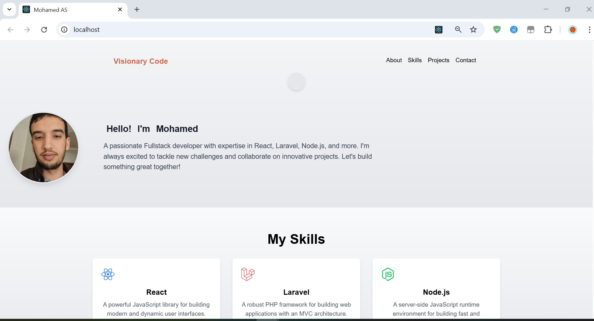

# 🚀 Portfolio Personnel – Mini-Projet Cloud

## 🔍 Présentation du projet
Ce projet est un portfolio personnel développé avec **React** (frontend uniquement, sans base de données).  
Il permet de présenter les projets, compétences et liens personnels.  
L'application est conteneurisée avec **Docker**, servie avec **Nginx** et publiée sur **Docker Hub**.

---

## 🛠️ Technologies utilisées
- React.js (Frontend)  
- Node.js (pour builder l’application React)  
- Docker (Conteneurisation)  
- Nginx (Serveur web pour la production)  
- Docker Hub (Hébergement de l’image Docker)  
- GitHub (Hébergement du code source)  

---

## 🗂️ Structure du projet

```plaintext
mini-projet-cloud/
│
├── app/                # Code source React
│   ├── public/
│   └── src/
│
├── Dockerfile          # Fichier de conteneurisation
├── docker-compose.yml  # Fichier pour démarrage simplifié (optionnel)
├── README.md           # Documentation
└── .gitignore
```

---

## ⚙️ Instructions de Build & Exécution locale

1. Clonage du projet :

```bash
git clone https://github.com/AitSaid-Mohamed/DevCloud2025.git  
cd DevCloud2025
```

2. Construction de l’image Docker :

```bash
docker build -t myportfolio-web .
```

3. Exécution de l’image :

```bash
docker run -p 8080:80 myportfolio-web
```

4. Ou avec Docker Compose :

```bash
docker-compose up --build -d
```

---

## 🧱 Dockerfile utilisé

```Dockerfile
# Étape 1 : Construction de l'application
FROM node:16-alpine AS build
WORKDIR /app
COPY package*.json ./
RUN npm install
COPY . .
RUN npm run build

# Étape 2 : Serveur Nginx pour la production
FROM nginx:alpine
COPY --from=build /app/build /usr/share/nginx/html
EXPOSE 80
CMD ["nginx", "-g", "daemon off;"]
```

---

## 🐳 docker-compose.yml

```yaml
version: '3'
services:
  web:
    build: .
    ports:
      - "80:80"
    networks:
      - react-network
networks:
  react-network:
    driver: bridge
```

---

## ☁️ Déploiement dans le Cloud

L’image Docker est disponible ici :

🔗 [DockerHub – moha69/myportfolio-web](https://hub.docker.com/repository/docker/moha69/myportfolio-web)

### Commandes utiles

```bash
docker pull moha69/myportfolio-web:v1.0
docker run -p 8080:80 moha69/myportfolio-web:v1.0
```

---

## 📎 Liens importants

- 💻 GitHub Repository : [https://github.com/AitSaid-Mohamed/DevCloud2025](https://github.com/AitSaid-Mohamed/DevCloud2025)  
- 🐳 DockerHub : [https://hub.docker.com/repository/docker/moha69/myportfolio-web](https://hub.docker.com/repository/docker/moha69/myportfolio-web)

---

## 👤 Auteur

- Mohamed Ait Said  
- Mini-Projet – Développement dans le Cloud  
- Université Mundiapolis – 2024/2025  

---

## 🎥 Démonstration (facultatif)




